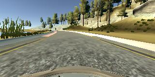
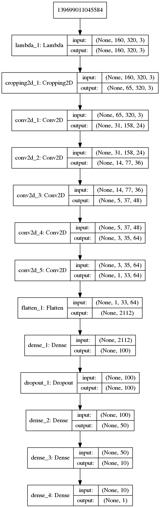

# **Behavioral Cloning** 

The goals / steps of this project are the following:
* Use the simulator to collect data of good driving behavior
* Build, a convolution neural network in Keras that predicts steering angles from images
* Train and validate the model with a training and validation set
* Test that the model successfully drives around track one without leaving the road
* Summarize the results

My project includes the following files:
* model.py: containing the script to create and train the model
* drive.py:   for driving the car in autonomous mode
* model.h5: containing a trained convolution neural network 
* writeup_report.md: summarizing the results
* video.mp4: the video recording of vehicle driving autonomously one lap around the first track

## Train data
### Collect data

I collect training data from two part, the first part is the Udacity data in the folder: *workspace/CarND-Behavioral-Cloning-P3/data*, the second part is collected in the first track by myself. 

In fact, I have collected lots of data in different scenarios, including driving normally for about 3 laps, driving counter-clockwis about 2 laps, recovery laps, driving just around curves both in clockwis and counter-clockwis and also some special segment where some errors happend. One image shown as following:

### Data generator
When we train our model, if we store the preprocessed data in memory all at once, that will take lots of memoery, especially for large amounts of data. So we need use the generator to pull pieces of the dataadn process them only when we need(model.py line30 - line 71). 

In order to use the multiple cameras images, one correction has been added as one parameter to adjust the steering value (line 32). And I have fliped the center image to get more train data (line 58, 59).

## Convolution neural network

According the NVIDIA network in the papaer *End to End Learning for Self-Driving Cars*, I implement my model in the *model.py* file which contains the code for training and saving the convolution neural network. The file shows the pipeline I used for training and validating the model, and it contains comments to explain how the code works. Here is one figure to show the model:

### Model architecture
The model begins with one lambda layer (line 85) and cropping layer (line 86): the lambda layer for normalizing the data, and the cropping layer for deleteing some useless information. Then several convolution layers are added:
1. Convolution layer with 5x5 kernel sizes, 2x2 strides and depths in 24 (line 87)
1. Convolution layer with 5x5 kernel sizes, 2x2 strides and depths in 36 (line 88)
1. Convolution layer with 5x5 kernel sizes, 2x2 strides and depths in 48 (line 89)
1. Convolution layer with 3x3 kernel sizes, 1x1 strides and depths in 64 (line 90)
1. Convolution layer with 3x3 kernel sizes, 1x1 strides and depths in 64 (line 91)

The model includes RELU layers to introduce nonlinearity. And then four fully connected layer give the steering output where one dropout layer is added to avoid the overfitting (line 92 - line 97).

### Overfitting in the model
The model contains **dropout** layers in order to reduce overfitting (lines 94). Furthermore, the **early stopping** is applied to stop the training at the right time. Two callback functions are instantiated (line 105, 106) and use in the training (line 109).

## Train model

### Model parameter tuning

The model used an adam optimizer, so the **learning rate** was not tuned manually (line 101).

At the begining, I didn't use the early stopping for avoiding overfittling. So I need to tune the **rate for dropout**. For remove the impact of steering correction, I just use the center image. I found that the rate for dropout could be set from 0.5 to 0.7. 

Then I tune the **steering correction** according some experance, and finally I use the value of 0.2.

I traind the model with lots of data (about 3GB) in epoch from 10 to 30, but still cannot get one good result which means the car cannot finish one lap in automous. When I check the *val_loss* in training, I found that the value has increased in some epoch even it finally decrease to lower value when training finished. So I am thinking maybe I can stop them early. I first train the model in just 5 epoch which give me one good result. Then I add the **early stopping** to the training.
